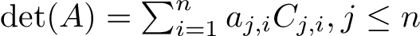
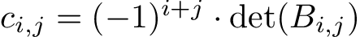
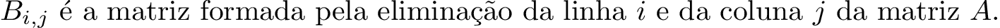
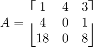
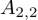
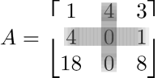
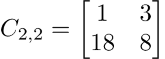
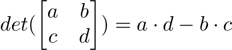
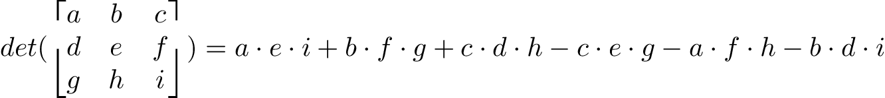

# Pesquisa Operacional II
## Revisão de Álgebra Linear - Inversão de Matrizes Pelo Método Gauss Jordan

Prof. M.Sc. Diego Ascânio Santos

Belo Horizonte, 2023.

---

Roteiro

1. Determinante de Matrizes
1.1. Cálculo pelo teorema de Laplace (Forma Genérica);
1.2. Determinante de Matrizes Quadradas $N=2$ e $N=3$;
2. Singularidade de Matrizes;
3. Construção da Matriz Inversa pelo Método de Gauss-Jordan;

---

# Determinante de Matrizes
---

Determinante de Matrizes

-Em matemática, determinante é uma função matricial que associa a cada matriz quadrada um escalar, ou seja, é uma função que transforma uma matriz quadrada em um número real;

-Esta função permite saber se a matriz tem ou não inversa;

---

Cálculo do Determinante pelo Teorema de Laplace

O teorema fornece uma expressão genérica para o determinante de uma matriz quadrada de qualquer tamanho em termos dos determinantes das matrizes de ordem inferior.

O enunciado preconiza que o determinante de uma matriz quadrada A é igual à soma algébrica dos produtos dos elementos de uma linha (ou coluna) pelos respectivos cofatores (complementos algébricos) destes elementos:

WTF IS COFATOR?

---

Complementos Algébricos - Cofatores

O complemento algébrico de um elemento  (ou <b>cofator</b>) é um número obtido através do cálculo das determinantes da(s) matrizes obtida(s) pela eliminação das respectivas linha e coluna do elemento na matriz A de origem, apresentando a seguinte fórmula:
 

 
Onde,  

---

Complementos Algébricos - Cofatores

Exemplo:
 

 
Qual o cofator do elemento ? Eliminando a segunda linha e a segunda coluna de A 
  temos a matriz resultante:    
Calculando o cofator a partir do determinante da matriz C, temos:  

---

Cálculo de determinantes - Regra de Sarrus

Podemos observar que a formula do calculo de determinantes através de cofatores generaliza para qualquer tamanho N. Entretanto, convém para as matrizes quadradadas de ordem 2 e 3, elicitar fórmulas de fácil memorização conhecidas como regra de Sarrus:

  
  

---

---

# Singularidade de Matrizes

---

Singularidade de Matrizes

+ Quando o determinante de uma matriz é nulo, diz-se que ela é singular.
+ Quando não-nulo é não-singular.

Isso vem ao caso na medida em que matrizes singulares não possuem inversas, portanto, só é possível calcular a inversa de uma matriz $A$ quando $det(A) \neq 0$.

<!-- Portanto, só convém calcular a inversa de uma matriz quando ela tiver deterinante não nulo -->

---

# Cálculo de Matriz Inversa pelo método de Gauss-Jordan.

---

Cálculo de Matriz Inversa pelo método de Gauss-Jordan.

Para calcular a inversa de uma matriz $A$ não-singular, um método eficiente é o de se aplicar operações lineares de comutação, soma (subtração) e multiplicação (divisão) por escalares nas linhas da matriz $A$, segundo o método de Gauss-Jordan, até diagonalizar e transformar a matriz A em uma matriz Identidade, aplicando-se ao mesmo tempo estas operações lineares em uma matriz identidade de dimensão N.

O término da aplicação destas operações na matriz identidade produz a matriz inversa $A^{-1}$

---

Cálculo de Matriz Inversa pelo método de Gauss-Jordan.

O algoritmo do cálculo da matriz inversa pode ser resumido da seguinte forma:

1. Aplique o método gauss-jordan na matriz $A$ para transformá-la na matriz identidade, tomando nota de cada operação (comutação, soma, multiplicação) efetuada;
2. Aplique cada operação (em ordem) do passo 1 na matriz identidade $I_{NxN}$

Ao término, a matriz construída no passo 2 é $A^{-1}$

---
# Exemplo (no Quadro)
## Conferência (Computacional)
